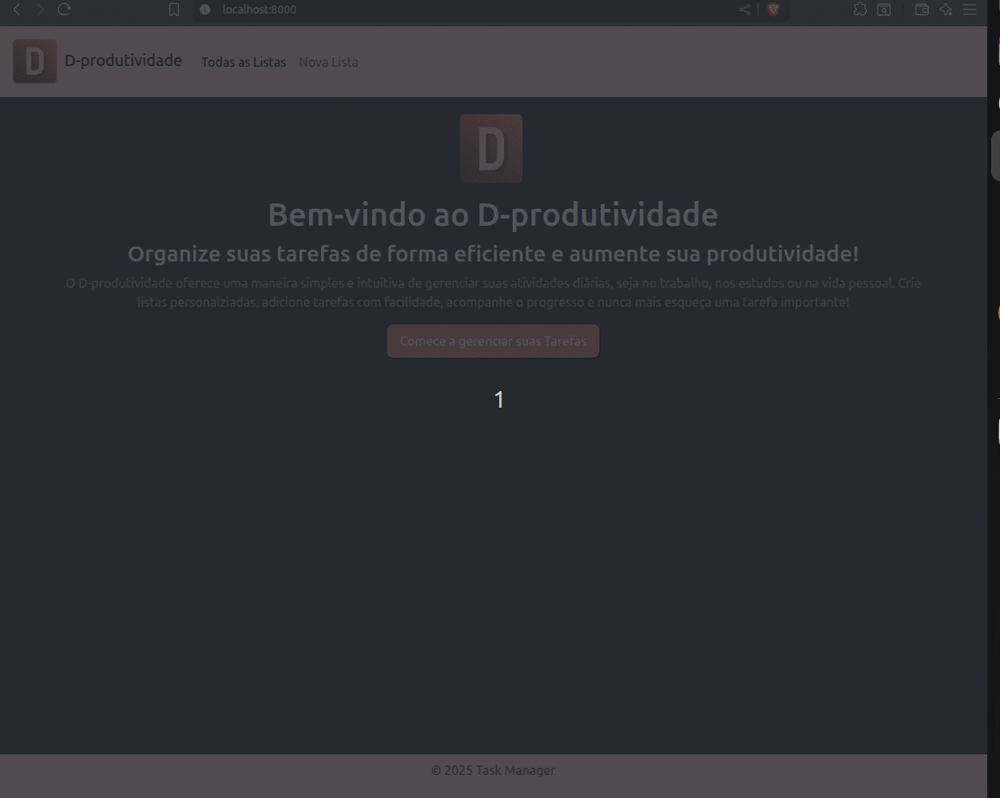

# 📌 D-produtividade

D-produtividade é uma aplicação web simples e intuitiva para **gerenciamento de tarefas**, desenvolvida com Node.js, Express, EJS e Bootstrap. O objetivo é permitir que o usuário crie listas personalizadas, adicione tarefas e organize sua rotina de forma prática e visualmente agradável.

⚠️ No momento, os dados são armazenados apenas em variáveis locais, ou seja, ao reiniciar o servidor eles são perdidos.
Em breve, o sistema será integrado a um banco de dados para persistência total.

---

## 📸 Preview do Projeto

---

## 🚀 Funcionalidades

 - Criar listas de tarefas personalizadas

 - Adicionar tarefas dentro de cada lista

 - Excluir listas e tarefas

 - Alterar o status atual da tarefa

 - Interface responsiva e estilizada com Bootstrap

 - Templates dinâmicos utilizando EJS

---

## 🛠 Tecnologias Utilizadas

 - Node.js — ambiente de execução JavaScript

 - Express — framework para criação do servidor e gerenciamento de rotas

 - EJS — template engine para renderização dinâmica no front-end

 - Bootstrap — framework CSS para layout responsivo

 - JavaScript (front e back-end)

 - HTML5 e CSS3

---

### ⚙️ Como Rodar Localmente

- git clone https://github.com/dboravitoria/d-produtividade.git
- cd d-produtividade
- npm install
- npm run dev

Acesse no navegador
- http://localhost:8000

---

### 📌 Próximos Passos

- Integrar com banco de dados (provavelmente MongoDB ou PostgreSQL)

- Adicionar autenticação de usuários

- Criar sistema de prioridade de tarefas

- Implementar filtro e busca nas listas

---
